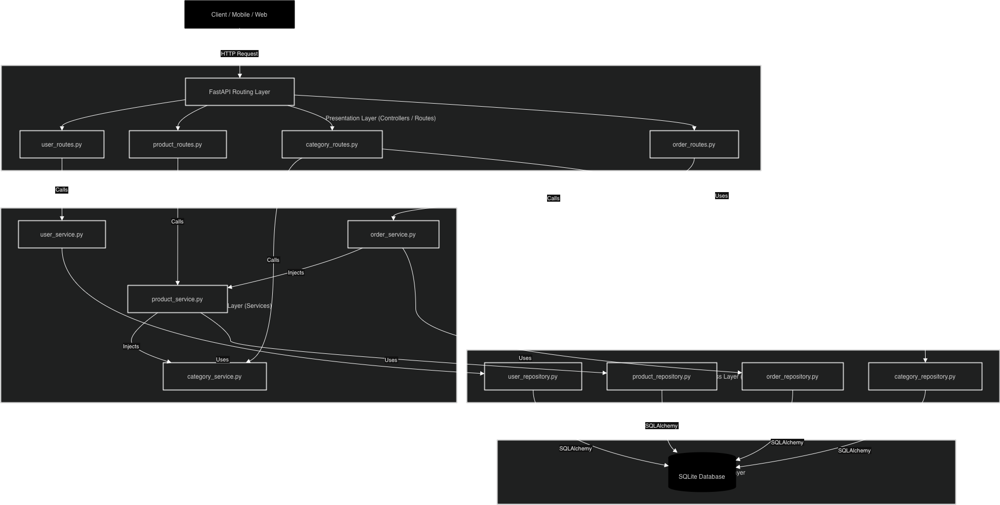

# Mini E-Commerce Production API

A production-ready, lightweight E-Commerce API built with Python and FastAPI. This project is organized with strict Separation of Concerns, dependency injection, and a feature-based vertical slice structure.

---

## 🏗️ System Architecture

This project uses a **Feature-Based / Vertical Slice** architecture. Each domain owns its own routes, services, repositories, models, and schemas.



---

## ✨ Features & API Endpoints

### 👥 Users Feature
- **POST /users/** - Register a new user
  - Validates email uniqueness
  - Returns user metadata and created response
- **GET /users/{username}** - Retrieve user by username
- **GET /users/email/{email}** - Retrieve user by email
- Login flows use access tokens and refresh tokens for secure session handling

### 🏷️ Categories Feature
- **GET /categories/** - Retrieve all product categories
- **POST /categories/** - Create or return an existing category

### 📦 Products Feature
- **POST /products/** - Create a new product
  - Prevents duplicate titles
  - Auto-creates category if needed
- **GET /products/** - List all products
- **GET /products/{product_id}** - Retrieve a single product by ID

### 🛒 Orders Feature
- **POST /orders/** - Place a new order (checkout)
  - Validates user and product existence
  - Checks inventory before placing the order
  - Deducts product stock and calculates total price

### 🤖 Chatbot Feature
The chatbot integrates with the e-commerce application to provide conversational assistance, order and product inquiries, and session-aware replies.

- **POST /chatbot/session** - Initialize a new chatbot session
  - Generates a unique `session_id`
  - Stores a welcome message in chat history
  - Returns the new session ID and welcome text

- **POST /chatbot/message** - Send a message to the AI assistant
  - Accepts `session_id`, `message`, and `cache_mode`
  - Persists incoming user messages to the database
  - Supports exact and semantic caching to reduce API calls
  - Returns the assistant response and stores it in chat history

#### Chatbot Cache Modes
The chatbot supports multiple cache strategies to improve performance and reduce redundant LLM requests.

- `exact` cache:
  - Matches the user message text exactly in Redis
  - Returns cached responses immediately when found
  - If no match exists, the request falls through to the LLM and the result is cached afterward

- `semantic` cache:
  - Uses sentence embeddings to compare query similarity
  - Returns cached responses for semantically similar user queries
  - Also updates exact cache for fast repeat lookups

- `disabled` cache:
  - Skips cache lookups entirely
  - Always queries the LLM directly

#### Chatbot Diagnostics and Observability
The chatbot logs diagnostics to `chatbot_diagnostics.log` with the following fields:
- `timestamp`
- `session_id`
- `cache_mode`
- `cache_status` (`HIT`, `MISS`, or `DISABLED`)
- `cache_hits`
- `db_hits`
- `latency_ms`
- `query`

This log supports performance monitoring, cache efficiency analysis, and tracking of database access patterns.

#### Token Usage
While the chatbot does not currently log token counts directly, it is built around LLM token usage principles:
- Each LLM request consumes input and output tokens based on message length and model behavior
- Caching reduces repeated LLM queries, which can lower token consumption and cost
- The `exact` and `semantic` cache modes are the primary mechanism for preserving tokens by reusing prior responses

---

## 🏛️ Architectural Layers

Each feature follows a clear layered pattern:

1. **Routes Layer** (`*_routes.py`) - API endpoint definitions and FastAPI wiring
2. **Service Layer** (`*_service.py`) - Business logic, caching orchestration, and AI integration
3. **Repository Layer** (`*_repository.py`) - ORM data access and persistence logic
4. **Models Layer** (`*_models.py`) - Database entities and Pydantic schemas

---

## 🔗 Cross-Domain Integration

- Products can create and assign categories automatically
- Orders coordinate users, products, and inventory updates
- Chatbot messages are persisted in the same database for session-aware responses
- The chatbot can bypass the LLM for direct order lookups when an order ID is detected

---

## 🚀 Running the API

```bash
PYTHONPATH=. fastapi dev app/main.py
```

The API will be available at `http://localhost:8000` with interactive docs at `http://localhost:8000/docs`
